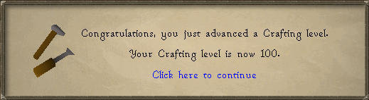

# Virtual Level Ups

Shows a level up dialog for reaching virtual level thresholds.

## Settings

### Take screenshots

Capture a screenshot of the client (similar to the Screenshot plugin) when reaching a new virtual
level

*Note:* Screenshots will be captured using your
[Screenshot plugin](https://github.com/runelite/runelite/wiki/Screenshot) settings.

### Show level-up fireworks

Show fireworks when reaching a new virtual level  
`Normal` will display fireworks like those seen at levels 2-98  
`Max` will show fireworks like seen at level 99
